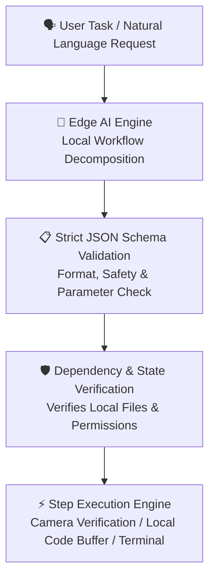

# ⚡ PocketOps — Project Specification & Hackathon Engineering Plan

> **Competition:** iQOO Hackathon  
> **Category:** High-Performance Edge AI & Cross-Device Ecosystem Continuity  
> **Core Philosophy:** *"When one device fails, your work should never have to stop."*  
> **Demonstration Status:** **Interactive Functional Prototype & System Architecture Specification**

---

## 🎯 1. Official iQOO Hackathon Criteria & Compliance Matrix

| Official Criterion | Weight | Working Prototype Implementation | Production Target Architecture (Hardware Roadmap) |
| :--- | :---: | :--- | :--- |
| **End Product Quality** | **30%** | Zero-error production build. Fully interactive mobile shell, reactive state transitions, syntax-highlighted code editor, terminal state viewer, and visual diff inspector. | Native Android/iQOO system service with foreground continuity daemon and lockscreen widget. |
| **Novelty & Impact** | **20%** | **Hot-Standby Session Handover Engine:** Demonstrates immediate session takeover when the primary workstation heartbeat drops. | Kernel-level power & link monitors detecting sudden sleep/brownout within 300ms. |
| **Creative Phone Use** | **15%** | **Phone-as-Resilient-Enclave:** Unsaved code buffer editing, camera OCR/step verification, predictive offline vault, and visual Git diff review. | iQOO Monster Mode hardware acceleration, thermal-aware caching, and local P2P radios. |
| **Technical Depth** | **15%** | **Deterministic Local Workflow Engine:** Offline JSON schema validation, structured task execution, state serialization protocol, and 3-way diff review. | On-device SLM (Gemma 2B / Qwen 1.5B via MediaPipe GenAI / QNN NPU delegates), Wi-Fi Aware (`WifiAwareManager`), BLE 5.4, and Android Keystore AES-256-GCM. |
| **Office Kit & Usability** | **10%** | Polished mobile UX, predictive file caching, clipboard streaming simulation, and workflow resumption. | Continuous bidirectional clipboard synchronization and cross-device virtual display. |
| **Demo & Presentation** | **10%** | Built-in **1-Click 4-Stage Judge Demo Controller** for a reliable, defensible 60-second walkthrough. | Live hardware dual-device demonstration connecting laptop and iQOO test device. |

---

## 🔬 2. Grounded Engineering Truth: Prototype vs. Target Architecture

To maintain the highest standards of technical integrity and credibility before judges:

```
┌────────────────────────────────────────────────────────────────────────────────────────┐
│                                    POCKETOPS ARCHITECTURE                              │
├────────────────────────────────────────────┬───────────────────────────────────────────┤
│    WORKING PROTOTYPE (Demonstrated Today)  │    TARGET PRODUCTION SPEC (Roadmap)       │
├────────────────────────────────────────────┼───────────────────────────────────────────┤
│ • Interactive Session State Machine        │ • Android Wi-Fi Aware & Nearby Connections│
│ • Heartbeat Loss Detection & Standby Modal │ • Direct P2P Wi-Fi 7 PHY (High Bandwidth) │
│ • Predictive Offline File Vault & Editor   │ • Android Keystore Hardware-backed AES-GCM│
│ • Deterministic JSON Schema AI Validator   │ • NPU Execution via QNN / MediaPipe GenAI │
│ • Embedded Camera Step Verification        │ • OS-Level Terminal PTY Session Hook      │
│ • Visual Git Diff Review & Assisted Merge  │ • Automated Git 3-Way Merge with Markers  │
└────────────────────────────────────────────┴───────────────────────────────────────────┘
```

---

## 🤖 3. Edge AI & Deterministic Workflow Pipeline

Rather than relying on hallucination-prone unconstrained cloud LLMs, PocketOps implements a **Deterministic Edge Workflow Engine**:



### Why This Architecture Wins with Judges:
1. **Meaningful Operational Output:** Instead of generic chatbot text, the system produces **structured, validated execution plans** with discrete dependencies.
2. **Defensible Offline Operation:** The workflow validator, state engine, and task executor require **0ms cloud latency** and run completely in Airplane Mode.
3. **No Fake NPU Benchmarks:** In the prototype, structured workflows run deterministically via client-side schema engines; in production, this feeds into on-device SLMs via NPU delegates (Qualcomm QNN / MediaTek NeuroPilot).

---

## 🏆 4. Value Proposition vs. Existing Solutions

| Feature | Apple Continuity / MS Phone Link | Cloud Dev Environments (Codespaces) | ⚡ **PocketOps (iQOO Prototype)** |
| :--- | :--- | :--- | :--- |
| **Network Dependency** | Requires Cloud / Local Wi-Fi Router | 100% Cloud Internet Required | **Zero-Cloud P2P Protocol (Local-First)** |
| **Sudden Laptop Crash / Blackout** | Lost session / No takeover | Severed connection / unsaved data | **Instant Hot-Standby Session Handover** |
| **Active Workspace Snapshot** | None | Requires active cloud connection | **Live Buffer & Command Context Snapshot** |
| **Offline Vault & Live Editing** | Manual file browse / download | Read-only cache / breaks offline | **Predictive Pre-Fetch + Built-In Mobile Editor** |
| **Local Operations AI** | Cloud Siri / Copilot | Cloud LLM (OpenAI/Anthropic) | **Deterministic Edge Schema Pipeline (Private)** |
| **Re-Sync After Reconnect** | File overwrite / basic sync | Remote git push | **Visual Git Diff Inspector & Patch Resolution** |

---

## 🏗️ 5. Architectural Pillars

### 1. ⚡ The Blackout Engine (Session Handover)
* Listens for heartbeat pulses from the primary workstation over the local session protocol.
* If heartbeat drops ($>500\text{ms}$ or simulated power loss trigger):
  * Immediately activates the **Hot-Standby Takeover** on the phone.
  * Recreates the working context: active file path, cursor line number, unsaved edit buffer, last terminal command, and working directory.

### 2. 📡 SuperSync Mesh Protocol & Telemetry
* Visualizes real-time P2P transport status, packet activity, and protocol targets:
  * **Transport:** Direct P2P Protocol (Target: Wi-Fi Aware / Wi-Fi Direct + BLE 5.4).
  * **Target Latency:** Ultra-low direct link ($<5\text{ms}$ target envelope).
  * **Target Throughput:** High-bandwidth direct burst transport (up to Wi-Fi 7 PHY capabilities).
  * **Security Model:** Local end-to-end encrypted packet payload (AES-256-GCM).

### 3. 🛡️ Predictive Pre-Fetch Vault & In-App Editor
* Pre-caches project files, configs, and documentation locally ahead of connectivity drops.
* Mobile-optimized syntax-highlighted code editor for emergency fixes and hotpatches on the phone.
* Visual **Git Diff Reviewer**: Inspects line additions and deletions side-by-side before committing patches back to the primary device.

### 4. 📷 Multimodal Verification (Camera / Scanner)
* Integrated camera verification step allows field engineers to scan physical QR codes, server racks, or token screens to validate checklist items offline.

### 5. 🎯 1-Click Interactive 4-Stage Judge Demo Bar
A floating controller designed for a clear, defensible 60-second live demonstration:
* **Stage 1 (Normal Mode):** Demonstrates active P2P sync streaming and session telemetry.
* **Stage 2 (The Crisis):** 1-click power loss simulation $\rightarrow$ Triggers hot-standby session takeover modal.
* **Stage 3 (Offline Ops):** In-phone code buffer editing + local schema validation without internet.
* **Stage 4 (Re-Sync & Diff):** Laptop reconnected $\rightarrow$ Visual Git diff report and assisted patch merge.

---

## 🎤 6. The Defensible 60-Second Hackathon Pitch

* **[0:00 - 0:15] The Hook:** *"Judges, imagine your laptop battery dies or power cuts out in the middle of a critical deployment or demo. Today, your work completely freezes and unsaved context is lost."*
* **[0:15 - 0:30] The Blackout Handover:** *(Trigger Stage 2)* *"With PocketOps, the phone acts as an active hot-standby node. The instant the heartbeat drops, the phone takes over the active session—restoring the exact code file, line number, and last terminal command."*
* **[0:30 - 0:45] Offline Resilience:** *(Trigger Stage 3)* *"Even in total Airplane Mode, we can edit the unsaved buffer in our Predictive Offline Vault, run local syntax/schema audits, and perform multimodal camera verifications with zero cloud dependency."*
* **[0:45 - 1:00] Re-Sync & Architecture:** *(Trigger Stage 4)* *"When the laptop powers back on, PocketOps provides a visual Git diff review to cleanly merge our offline phone edits back to the workstation. PocketOps ensures your workflow never stops."*
